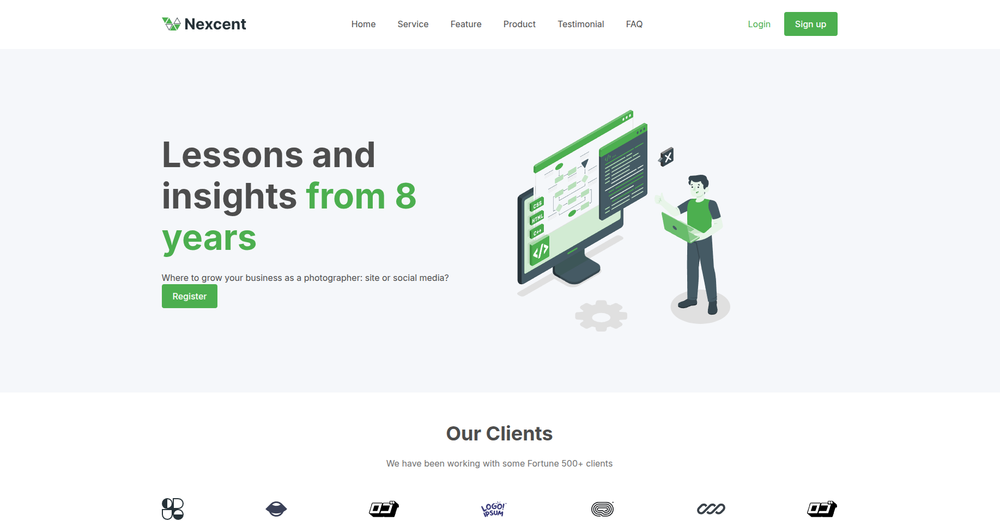

# Nexcent

Modern and minimalist landing page for a creative agency. Clean design with smooth animations and a focus on user experience.



## Project Structure

```
PRUEBA/
│
├── index.html          # Main HTML file
├── styles.css          # Styles CSS
├── assets/             # Resources folder
└── README.md
```

## Characteristics

- Minimalist and professional design
- Fully responsive (mobile, tablet, and desktop)
- Smooth animations
- Conversion-optimized sections
- Fixed navigation with smooth scrolling
- Modern grid layout with CSS Grid and Flexbox
- Customizable color palette using CSS variables

## Technologies Used

- HTML5
- CSS3 (Grid, Flexbox, Custom Properties)
- Google Fonts (Inter & Poppins)
- SVG for iconography

## Colors
Modify the CSS variables in `styles.css`:

```
:root {
    --primary: #4CAF4F; 
    --secondary: #263238; 
    --text-dark: #4D4D4D; 
    --text-gray: #717171;
    --bg-silver: #F5F7FA;
    --white: #ffffff;
}
```

## Responsive Design

The design adapts to three main breakpoints:
- Desktop: > 1024px
- Tablet: 768px - 1024px
- Mobile: < 768px